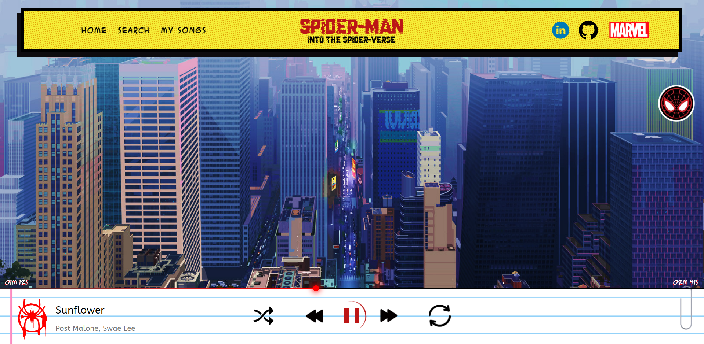
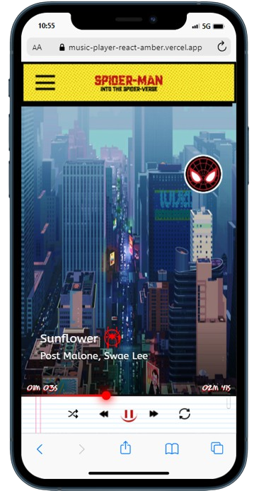
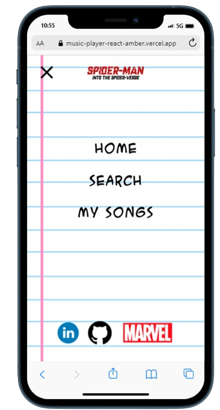

<h1 align="center">
  Music Player with React
</h1>

  
  
  
  
  
  
  
  

  

  

  

  

## 💻 Projeto
Lorem ipsum dolor sit amet, consectetur adipiscing elit, sed do eiusmod tempor incididunt ut labore et dolore magna aliqua. Orci phasellus egestas tellus rutrum tellus pellentesque eu tincidunt tortor

[Ver Projeto](https://music-player-react-amber.vercel.app/)

## 🚀 Tecnologias
  

- HTML
- CSS
- Javascript

## 📔 Conhecimentos fortalecidos

- [x] Uso básico do figma .
- [x] Tokens no projeto`.
- [x] css e responsividade.
- [x] Javascript.
- [x] Criação de itens em listas.
- [x] Tecnicas de animação em css.

## 💻 Imagens mobile

  
  

